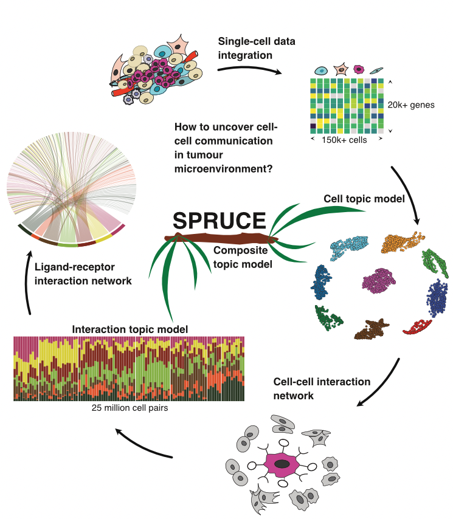

## SPRUCE: Single-cell Pairwise Relationships Untangled by Composite Embedding model

<div align="center">
    
</div>

### Summary
In multi-cellular organisms, cell identity and functions are primed and refined through interactions with other surrounding cells. Here, we propose a scalable machine learning method, termed SPURCE, which is designed to systematically ascertain common cell-cell communication patterns embedded in single-cell RNA-seq data. We applied our approach to investigate tumour microenvironments consolidating multiple breast cancer data sets and found seven frequently-observed interaction signatures and underlying gene-gene interaction networks. Our results implicate that a part of tumour heterogeneity, especially within the same subtype, is better understood by differential interaction patterns rather than the static expression of known marker genes.

### Prerequisites

* python - numpy, pandas, scipy, sklearn, annoy, pytorch, igraph, seaborn
* R - celldex, SingleR, SingleCellExperiment, ggplot2, pheatmap, circlize, bipartite

### Installation


* Clone the repo
   ```sh
   git clone https://github.com/causalpathlab/spruceTopic.git
   ```